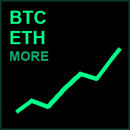
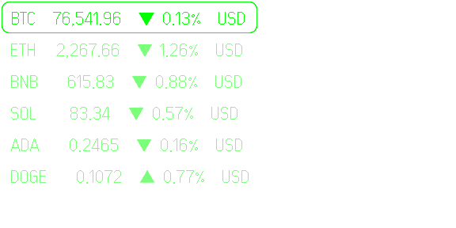
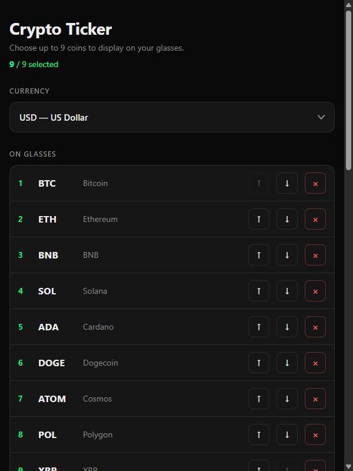

# Crypto Ticker — Even Realities G2

Live cryptocurrency prices and charts for the Even G2 smart glasses, built as an Even Hub web app.

The app runs as HTML/JS inside the Even Realities companion app's WebView. The phone-side UI is a settings/picker screen. The glass-side UI is a list of selected coins with live Binance WebSocket prices and a tappable detail page that includes a 1D/1W/1M/1Y line chart fetched from Binance REST klines.

## Screenshots

| Glasses — list | Glasses — detail | Companion app |
|:--:|:--:|:--:|
|  |  |  |
| LVGL ListContainer, selection border on the active row, currency suffix per item | Chart, dashed L-frame, LVGL Y-max/Y-min + period/now labels, range tabs | Currency dropdown + watchlist editor |

## Quick start

Two terminals.

**Vite dev server:**
```bash
cd crypto-ticker
npm install
npm run dev
```
Serves at `http://localhost:5174/`.

**Simulator** (separate window):
```bash
npx evenhub-simulator http://localhost:5174 --glow
```
Opens two panes: `Browser` (the phone-side settings UI) and `Glasses Display` (the lens render).

To open DevTools in the Browser pane: right-click → Inspect, or F12.

## Glass-side UX

**List mode (default — root page):**
| Action | Effect |
|---|---|
| `Up` / `Down` | Move `「 」` cursor through the watchlist |
| `Click` | Enter detail view for selected coin |
| `Double Click` | Show host exit-confirm dialog (`shutDownPageContainer(1)`) — closes the app |

**Detail mode:**
| Action | Effect |
|---|---|
| `Up` / `Down` | Cycle range tabs `[24h]` → `[1W]` → `[1M]` → `[1Y]` → `[ALL]` |
| `Click` | Advance to the next range (mirrors typical G2 single-tap convention) |
| `Double Click` | Return to list |

> Note: the simulator's `Click` button does not dispatch `CLICK_EVENT` — only `DOUBLE_CLICK_EVENT` reliably fires. The handler accepts both, but treat double-click as the primary action.

## Phone-side picker (Browser pane)

- **Currency dropdown:** 7 fiats (`USD`, `EUR`, `ARS`, `JPY`, `TRY`, `BRL`, `PLN`) + 3 stablecoins (`USDT`, `USDC`, `FDUSD`). USD is a display alias for Binance USDT pairs (no native USD spot pair on Binance). Each quote uses the matching number locale (e.g. `de-DE` for EUR, `ja-JP` for JPY).
- **Watchlist:** up to 9 of 30 catalog coins; reorder with ↑/↓ buttons; drop with ×; add unselected with `+`
- Settings persist in `window.localStorage` under `ticker.watchlist` and `ticker.quote`

## Architecture

### Container layout — list mode (1 ListContainer)

```
┌─────────────────────────────────────────────┐  y=0
│ ╔═════════════════════════════════════════╗ │
│ ║ BTC   76,200   ▼ 2.10%   USD            ║ │  ← selected (border)
│ ╚═════════════════════════════════════════╝ │
│   ETH   2,275   ▼ 1.97%   USD               │
│   BNB   615.73  ▼ 0.98%   USD               │
│   ...                                       │
└─────────────────────────────────────────────┘  y=252
```

The root page is a single `ListContainerProperty` with `isItemSelectBorderEn=1` so the firmware draws the selection border. Each item is a composite single-line string with the currency suffix appended, since LVGL's proportional embedded font means we can't pixel-align separate columns inside one item. **This is the only navigation pattern that lets `DOUBLE_CLICK_EVENT` reach the page-level `shutDownPageContainer(1)` exit dialog** — text containers consume LVGL input events even with `isEventCapture=0`/`scrollable=0` and silently block the exit. List events arrive on `event.listEvent` with `currentSelectItemIndex`, which we mirror into `selectedIndex`. Price refresh happens via a throttled `rebuildPageContainer` (no `listContainerUpgrade` exists in SDK 0.0.10) and is deferred while the user is actively scrolling.

### Container layout — detail mode (6 text + 2 image, max 8)

```
┌──────────────────────────┬──────────────────┐  y=0
│ BTC Bitcoin  76,308 USD  │   「24h」        │
│ ▼ 2.05% 24h              │    1W            │
│ H: 78,265.00 USD         │    1M            │  info + tabs
│ L: 75,925.00 USD         │    1Y            │  (LVGL text)
│                          │    ALL           │
├──────────────────────────┴──────────────┬───┤  y=144
│  /\           ┊                         │77,│
│ /  \      /\  ┊                         │815│  Y-max (LVGL)
│     \    /  \_┊                         │USD│
│      \__/     ┊                         │76,│  Y-min (LVGL)
│ ╌╌╌╌╌╌╌╌╌╌╌╌╌╌┘                         │229│
│                                         │USD│
├─ -24h ────────────────────────── now ───┴───┤  y=258
└─────────────────────────────────────────────┘  y=288
  x=0..200 chart-L  x=200..400 chart-R  x=400..576 Y-axis labels
                                        (LVGL text in 176-px gutter)
```

The chart canvas is split into two 200×114 image halves so each fits under the firmware's 288-px image-container width cap. All Y-axis values, period labels (`-24h`, `now`), and tabs are LVGL text containers — the chart canvas paints only the price line and the dashed L-frame axis.

### Data flow

```
Binance WS  ─── tick ───►  latest map ──► flushRender ──► textContainerUpgrade
(streams)                       │                                    │
                                ▼                                    ▼
Binance REST  ─── klines ─►  pushChart ─► canvas ─► PNG ─► updateImageRawData ──► glasses
(detail mode only)                                                              (BLE)
```

### State machine

- `mode: "list" | "detail"` — drives event routing and which containers exist
- `selectedIndex` — current cursor row in list / current coin in detail
- `detailRange: "24h" | "1W" | "1M" | "1Y" | "ALL"` — current tab, drives klines fetch
- `quote: Quote` — one of 10 fiats/stablecoins, drives WS pair, number locale, and currency suffix
- `klinesFetchToken` — monotonically increasing; protects against stale REST responses overwriting newer ones

## File map

```
crypto-ticker/
├── app.json              Even Hub manifest (package_id, network whitelist)
├── package.json          Vite + SDK + simulator + CLI deps
├── tsconfig.json
├── vite.config.ts        Dev server port 5174
├── index.html            Mounts /src/main.ts; <div id="app"> for picker
└── src/
    ├── main.ts           Orchestrator: bridge bootstrap, state, event handler
    ├── catalog.ts        30-coin list, Quote types, pairFor() helper
    ├── storage.ts        loadWatchlist / saveWatchlist / loadQuote / saveQuote
    ├── format.ts         formatPrice + formatPriceAxis (locale-aware), liveCells / loadingCells / noDataCells
    ├── binance.ts        subscribeTicker (WS), fetchKlines (REST)
    ├── chart.ts          renderChartHalves: canvas → two PNG halves (price line + dashed L-frame, no text)
    ├── settings.ts       Phone-side picker UI (currency toggle + watchlist)
    └── styles.css        Dark mobile-style theme for picker
```

## Hardware caveats

This app has been validated **only in the simulator**. Open questions for real G2 hardware:

1. **Image format.** The SDK class is `ImageRawDataUpdate` ("raw") and design docs mention 4-bit greyscale, but the simulator decodes `imageData` as a standard image format (PNG works). Real hardware behavior — through the Flutter companion app → BLE → glasses firmware — is unconfirmed. If PNG fails on hardware, the fallback path is to pack pixels into a `(w*h)/2`-byte buffer (2 pixels per byte, high nibble = leftmost, value 0–15 = intensity).
2. **BLE timing.** Current updates send full container content (~80–200 chars per text upgrade, ~1–3 KB per chart push). On hardware, BLE fragmentation may add latency. The dual-arm BLE protocol (left → ACK → right) is handled by the SDK.
3. **Single tap.** `CLICK_EVENT` doesn't fire in the simulator. On the actual touchpad, single-tap behavior may differ.
4. **Glow + pixel ridges.** The lens micro-LED renders text with visible pixel ridges; what looks crisp in the simulator may look more retro on hardware.

## Distribution

- **Sideload:** `evenhub login` then `evenhub pack app.json dist` produces a `.ehpk`. Upload via the developer portal to flash to your own G2.
- **Publish:** application-based via the Even Hub Early Developer Program (`https://hub.evenrealities.com`). Revenue share / publishing fees not publicly disclosed.

## Data sources

All market data comes from **[Binance](https://www.binance.com/)** public APIs (no key required, no auth):

| What | Endpoint | Why |
|---|---|---|
| Live ticker prices + 24h change | WebSocket `wss://stream.binance.com:9443/stream?streams=...@ticker` | Sub-second updates pushed for every selected pair |
| Historical klines (chart) | REST `GET https://api.binance.com/api/v3/klines` | Closing prices over the selected time range (24h / 1W / 1M / 1Y / ALL) |

The app whitelists only these two Binance endpoints in `app.json`'s `network` permission. No personal data is sent. No analytics, no telemetry.

Binance is the trademark of Binance Holdings Ltd. This project is an unofficial third-party client that reads public price data; it has no affiliation with or endorsement from Binance.

## Resources

- Even Hub docs: https://hub.evenrealities.com/docs
- SDK: `@evenrealities/even_hub_sdk`
- Simulator: `@evenrealities/evenhub-simulator`
- CLI: `@evenrealities/evenhub-cli`
- Discord: https://discord.gg/GsuDkKDXDe
- Even Realities GitHub: https://github.com/even-realities
- Binance API docs: https://developers.binance.com/docs/binance-spot-api-docs

## Known issues

- Visual scroll glitch when moving cursor in list mode (LVGL redraw artifact, deferred)
- Simulator does not visually preview image containers identically to hardware; chart appearance on real G2 unknown
- Long coin names (e.g. "Ethereum Classic") may overflow the info container's first line in detail mode and wrap

## License & privacy

- License: [MIT](LICENSE)
- Privacy policy: [docs/PRIVACY.md](docs/PRIVACY.md) — no personal data collected; only public Binance APIs are contacted
